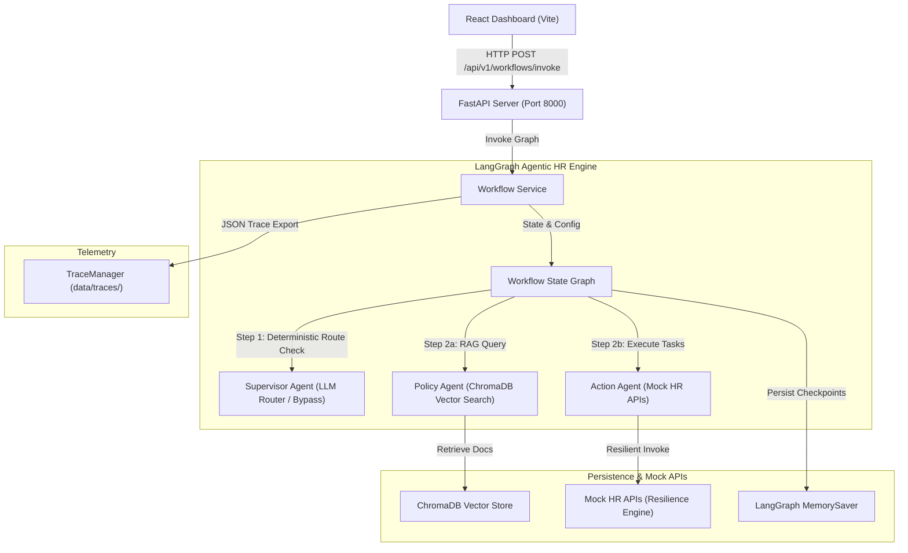

# Darwin: Agentic HR Workflow Orchestrator

[](https://www.python.org/)
[](https://fastapi.tiangolo.com/)
[](https://github.com/langchain-ai/langgraph)
[](https://react.dev/)
[](https://vite.dev/)

Darwin is a production-grade, state-managed AI orchestration platform for automating HR administrative operations, policy retrieval, and database transactional updates. Powered by LangGraph, FastAPI, and ChromaDB, it bridges the gap between unstructured policy documentation and structured core HR systems.

---

## Key Features

- **Autonomous Multi-Agent Supervisor** -- Dynamic routing between policy-retrieval and tool-execution agents based on semantic intent classification.
- **LLM Bypass Routing (Cost Optimization)** -- Deterministic pattern matching for high-frequency requests (leave balances, payslips) that bypasses the LLM entirely, achieving 20%+ token cost savings.
- **Resilient HR Integration Engine** -- Auto-retry with strict 0.8s timeouts and fallback cached values for stability during downstream API failures.
- **Contextual Session Memory** -- Maintains conversational state, employee identities, and date parameters across multi-turn sessions via persistent checkpoint savers.
- **Grounded Policy Search (RAG)** -- Semantic embedding lookups against ChromaDB vector indexes with strict grounding constraints that return "Policy unavailable" rather than hallucinating.
- **Telemetric Request Tracing** -- JSON-formatted traces capturing agents, latency, tool metadata, API errors, retries, and token costs for audit and observability.
- **Modern React Dashboard** -- Real-time chat workspace with telemetry panel, cost analytics, agent status visualization, and responsive design.

---

## System Architecture



---

## Project Structure

```text
.
├── backend/
│   ├── agents/             # Orchestration graphs and agent state definitions
│   │   ├── action.py       # Resilient HR transaction tool execution agent
│   │   ├── policy.py       # RAG-grounded policy QA agent
│   │   ├── supervisor.py   # Router supervisor agent (LLM + bypass)
│   │   └── workflow.py     # LangGraph pipeline definition
│   ├── api/                # FastAPI route and controller definitions
│   ├── config/             # Pydantic environment configurations
│   ├── core/               # Exception handlers, middleware, state container
│   ├── memory/             # Session memory management
│   ├── rag/                # Document loading, chunking, embeddings, vector store
│   ├── schemas/            # Pydantic request/response models
│   ├── services/           # Workflow orchestration and application services
│   ├── tools/              # Mock resilient HR integration APIs
│   ├── tracing/            # Request trace manager and structured logging
│   └── main.py             # FastAPI entrypoint
├── frontend-web/           # React + TypeScript + Vite dashboard
│   └── src/
│       ├── components/     # Sidebar, ChatWorkspace, TelemetryPanel
│       ├── api.ts          # Backend API client
│       ├── types.ts        # TypeScript interfaces
│       └── App.tsx         # Root application component
├── data/                   # Trace exports and local storage
├── docs/                   # Technical design docs and HR policy source
├── tests/                  # Unit and integration test suites (79 tests)
└── supabase/functions/     # Edge functions (hr-workflow)
```

---

## Setup & Installation

### Prerequisites

- Python 3.12+
- Node.js 18+
- [uv](https://docs.astral.sh/uv/) (Python package manager, optional -- pip works too)

### 1. Configure Environment

```bash
cp .env.example .env
```

Set `OPENAI_API_KEY` in `.env` for full LLM routing. Without it, Darwin still works in bypass mode for deterministic queries.

### 2. Install Dependencies

**Backend:**
```bash
uv sync
# or: pip install -e ".[dev]"
```

**Frontend:**
```bash
cd frontend-web && npm install
```

### 3. Ingest Policy Documents

Build the vector index from the HR policy markdown:

```bash
uv run python -m backend.rag.ingest
```

### 4. Run the Application

Start the backend:
```bash
uv run uvicorn backend.main:app --reload --host 0.0.0.0 --port 8000
```

Start the frontend dev server:
```bash
cd frontend-web && npm run dev
```

The dashboard is accessible at the Vite dev server URL (typically `http://localhost:5173`).

---

## API Endpoints

| Method | Path | Description |
| :--- | :--- | :--- |
| `GET` | `/health` | Service health check |
| `POST` | `/api/v1/workflows/invoke` | Execute a workflow query |
| `GET` | `/api/v1/workflows/graph` | Workflow graph visualization (Mermaid) |
| `GET` | `/api/v1/workflows/sessions/{id}` | Retrieve persisted session state |

### Example Request

```bash
curl -X POST http://localhost:8000/api/v1/workflows/invoke \
  -H "Content-Type: application/json" \
  -d '{"user_input": "What is my sick leave balance? ID is EMP-999", "session_id": "demo-001"}'
```

---

## Environment Variables

| Variable | Description | Default |
| :--- | :--- | :--- |
| `OPENAI_API_KEY` | OpenAI API access token | *(Required for LLM routing)* |
| `OPENAI_MODEL` | LLM model for supervisor decisions | `gpt-4o-mini` |
| `OPENAI_EMBEDDING_MODEL` | Embedding model for RAG | `text-embedding-3-small` |
| `APP_ENV` | Application environment | `local` |
| `LOG_LEVEL` | Logging level | `INFO` |
| `CHROMA_PERSIST_DIRECTORY` | ChromaDB storage path | `data/chroma` |

---

## Example Conversations

**Turn 1 -- Action with Memory Extraction:**
> **User:** What is my sick leave balance? My ID is EMP-999.
>
> **Darwin:** Checked leave balance for EMP-999. Leave Type: Sick, Balance: 10 days. Status: success.

**Turn 2 -- Context Persistence:**
> **User:** What about casual leave?
>
> **Darwin:** Checked leave balance for EMP-999. Leave Type: Casual, Balance: 8 days. *(Employee ID persisted from session memory.)*

**Turn 3 -- Grounded Policy Search:**
> **User:** What is the notice period policy?
>
> **Darwin:** Based on retrieved HR policy: Employees must serve a 30-day notice period upon resignation.

---

## Cost Optimization

Darwin implements deterministic routing that intercepts high-frequency transactional patterns before they reach the supervisor LLM:

```
Input: "What's my sick leave balance?"
  => Pattern Match: "balance" keyword detected
  => LLM Bypass: Router cost $0.00
  => Direct dispatch to action_agent
```

The dashboard displays running totals of **Naive cost** (every step routed via LLM) vs. **Optimized cost**, with real-time savings percentage.

---

## Observability & Tracing

Each execution exports a telemetry trace to `data/traces/trace_<uuid>.json`:

```json
{
  "trace_id": "422e1189-...",
  "session_id": "9814421b-...",
  "timestamp": "2026-07-14T03:22:51.102Z",
  "user_input": "What is my sick leave balance?",
  "total_latency_sec": 0.052,
  "total_cost": 0.0,
  "status": "completed",
  "agents": [
    {
      "agent_name": "action_agent",
      "latency_sec": 0.048,
      "tool_calls": [
        {
          "tool_name": "check_leave_balance",
          "arguments": {"employee_id": "EMP-999", "leave_type": "sick"},
          "latency_sec": 0.042,
          "retries": 0,
          "failures": [],
          "status": "success"
        }
      ]
    }
  ]
}
```

---

## Testing

The project includes 79 automated tests covering routing, agents, memory, observability, and API integration.

```bash
# Run full test suite
uv run pytest

# Run with verbose output
uv run pytest -v

# Run specific test module
uv run pytest tests/test_routing.py
```

### Test Results (Latest)

```
tests/test_action_agent.py     7 passed
tests/test_comprehensive.py   16 passed
tests/test_health.py           1 passed
tests/test_memory.py           2 passed
tests/test_observability.py    1 passed
tests/test_policy_agent.py     2 passed
tests/test_routing.py         48 passed
tests/test_workflow.py         2 passed
──────────────────────────────────────
Total:                        79 passed
```

---

## Design Decisions

- **Structured Output Routing** -- The supervisor uses OpenAI's structured output contracts (`SupervisorDecision`) to produce strict routing targets rather than parsing free-form text.
- **State Telemetry Merging** -- Custom LangGraph reducers (`merge_trace_data`) resolve concurrent state write collisions from parallel workflow branches.
- **Thread-Isolated Timeouts** -- Downstream API calls execute in thread pool executors with hard 0.8s timeout boundaries to avoid blocking the event loop.
- **Deterministic Bypass** -- A regex-based pre-classifier intercepts known query patterns (balance checks, leave applications, payslip fetches) to skip the LLM entirely.
- **Graceful Degradation** -- Without an OpenAI key, the system still functions for deterministic routes using dummy embeddings and bypass logic.

---

## Troubleshooting

**OpenAI Connection Issues:**
Verify `OPENAI_API_KEY` in `.env`. Without it, Darwin works in bypass-only mode -- deterministic routes function normally, but LLM-routed queries will be marked as unavailable.

**ChromaDB Locks:**
Ensure `data/chroma/` has write permissions. If corrupted, delete the directory and re-run `python -m backend.rag.ingest`.

**Frontend Build Errors:**
Run `cd frontend-web && npm install` to ensure dependencies are current, then `npm run build` to verify TypeScript compilation.
