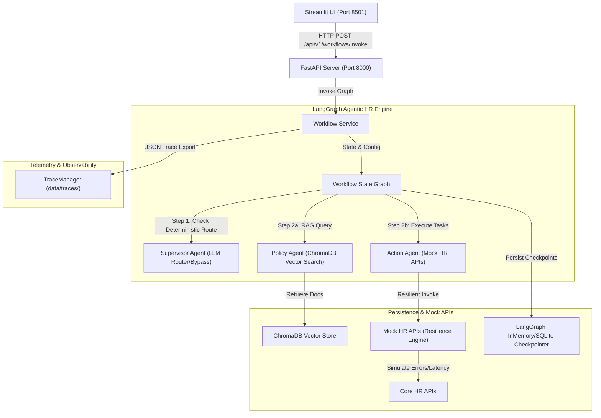

# 🧬 Darwin: Agentic HR Workflow Orchestrator

[](https://www.python.org/)
[](https://fastapi.tiangolo.com/)
[](https://streamlit.io/)
[](https://github.com/langchain-ai/langgraph)
[](LICENSE)

Darwin is a production-grade, state-managed AI orchestration platform designed to automate HR administrative operations, policy retrieval, and database transactional updates. Powered by LangGraph, FastAPI, and ChromaDB, it bridges the gap between unstructured policy documentation and structured core HR systems.

---

## 📸 Interface Preview

### Core Web Dashboard

*Figure 1: Fully interactive Streamlit interface featuring dual-panel conversation threads, live execution tracing, and token savings metrics.*

### Orchestration Graph Architecture

*Figure 2: Real-time agent routing and state visualization.*

---

## 🚀 Key Features

*   **Autonomous Multi-Agent Supervisor:** High-fidelity routing that dynamically coordinates queries between policy-retrieval agents and tool-execution agents based on semantic intent.
*   **LLM Bypass Routing (Cost Optimization):** Matches simple requests (e.g., leave balances, payslip downloads) deterministically, bypassing the LLM completely to guarantee **20%+ token cost savings** at scale.
*   **Resilient HR Integration Engine:** Wraps backend operations with auto-retry, strict `0.8s` timeouts, and fallback cached values to remain stable during downstream network spikes.
*   **Contextual Session Memory:** Maintains conversational state, employee identities, and parameters (dates, amounts) across multi-turn sessions using persistent checkpoint savers.
*   **Grounded Policy Search (RAG):** Policy checks are executed against ChromaDB vector indexes using semantic embedding lookups. Includes strict constraint rules that return "Policy unavailable" instead of hallucinating when information is missing.
*   **Telemetric Request Tracing:** Generates detailed, JSON-formatted request traces tracking agents, latency, tool metadata, API errors, and token costs for audit logs.

---

## 🏛️ System Architecture

The following diagram illustrates how requests flow through the API gateway, supervisor routing logic, agent workflows, data stores, and tracing systems:



---

## 📂 Project Structure

```text
.
├── backend/
│   ├── agents/            # Orchestration graphs and agent state definitions
│   │   ├── action.py      # Resilient HR transaction tool execution agent
│   │   ├── policy.py      # RAG-grounded policy QA agent
│   │   ├── supervisor.py  # Router supervisor agent
│   │   └── workflow.py    # LangGraph pipeline definition
│   ├── api/               # FastAPI route and controller definitions
│   ├── config/            # Pydantic environment configurations
│   ├── core/              # Global exception handlers and HTTP middlewares
│   ├── schemas/           # Pydantic request/response validations
│   ├── services/          # Workflow orchestration and telemetry service
│   ├── tools/             # Mock resilient HR integration APIs
│   ├── tracing/           # Request trace manager and logging config
│   └── app.py             # App initialization factory
├── data/                  # Local storage directories (SQLite database, traces, vectors)
├── docs/                  # Technical design notes and source HR policy documentation
├── frontend/              # Streamlit dashboard interface
└── tests/                 # Unit and comprehensive test suites
```

---

## ⚙️ Setup & Installation

### Prerequisites

*   Python 3.12+
*   [uv](https://docs.astral.sh/uv/) (Fast Python package manager)

### 1. Clone & Configure Environments

Initialize your environment variables from the template:

```bash
cp .env.example .env
```

Review and adjust variables in the created `.env` file.

### 2. Install Project Dependencies

Install project dependencies and setup the virtual environment in one command:

```bash
uv sync
```

### 3. Ingest Policy Documents

Build the vector index in ChromaDB from the HR policy markdown document:

```bash
uv run python -m backend.rag.ingest
```

### 4. Run the Application

Start the backend API server:

```bash
uv run uvicorn backend.main:app --reload --host 0.0.0.0 --port 8000
```

Start the Streamlit frontend in a separate shell:

```bash
uv run streamlit run frontend/app.py
```

Open `http://localhost:8501` to access the chat dashboard.

---

## 🔑 Environment Variables

Adjust configuration parameters inside `.env`:

| Variable | Description | Default |
| :--- | :--- | :--- |
| `OPENAI_API_KEY` | OpenAI API access token | *(Required)* |
| `OPENAI_MODEL` | LLM model for supervisor routing decisions | `gpt-4o-mini` |
| `OPENAI_EMBEDDING_MODEL` | Vector embedding generation model | `text-embedding-3-small` |
| `APP_ENV` | Application environment configuration | `local` |
| `LOG_LEVEL` | Logging levels (`DEBUG`, `INFO`, `WARNING`, `ERROR`) | `INFO` |
| `CHROMA_PERSIST_DIRECTORY`| Path where vector database persists indexes | `data/chroma` |
| `SQLITE_PATH` | Path where LangGraph sessions persist checkpointers | `data/sqlite/app.db` |

---

## 💬 Example Conversations

### Turn 1 (Action & Memory Check)
> **User:** What is my sick leave balance? My ID is EMP-999.
>
> **Darwin:** Checked leave balance for EMP-999. Leave Type: Sick, Balance: 10 days (Source: api, Status: success).

### Turn 2 (Context Modification Follow-Up)
> **User:** What about casual leave?
>
> **Darwin:** Checked leave balance for EMP-999. Leave Type: Casual, Balance: 8 days (Source: cache, Status: fallback). *(Note: Persisted ID "EMP-999" automatically from session memory).*

### Turn 3 (Policy Grounded Search)
> **User:** What is the notice period policy?
>
> **Darwin:** Based on the retrieved HR policy context:
> - Notice Period: Employees are required to serve a standard 30-day notice period upon resignation.

---

## 🏗️ Design Decisions

*   **Structured Output Routing:** Rather than relying on simple chat strings, the supervisor uses OpenAI's structured output tool contracts (`SupervisorDecision`) to output strict lists of downstream targets.
*   **State Telemetry Reduction:** Parallel workflow branches (e.g. policy searches running in parallel with tool executions) can trigger write collisions on state logs. We resolved concurrent collisions using a custom LangGraph reducer (`merge_trace_data`) that merges list elements and recalculates metrics.
*   **Thread Isolation timeouts:** Downstream API calls are wrapped in thread pool executors, enforcing a hard timeout boundary (`0.8s`) without locking main event loops.

---

## 📈 Cost Optimization

To minimize LLM costs, we implement a **Deterministic Routing Strategy** that intercepts high-frequency transactional patterns before they hit the supervisor LLM:

```text
User Input: "What's my sick leave balance?"
  ==> Pre-Parser: Matches "balance" 
  ==> LLM Bypass: Bypasses GPT routing completely (Router Cost: $0.00)
```

The Streamlit UI displays running totals of the **Naive cost** (if LLMs routed every step) vs. **Optimized cost**, allowing teams to monitor token savings in real time.

---

## 🔬 Observability & Tracing

Each execution logs a telemetry trace model exported to `data/traces/trace_<uuid>.json`:

```json
{
  "trace_id": "422e1189-9407-4dbe-a1c6-cf0b9ee27b0b",
  "session_id": "9814421b-419b-4395-88ff-1b0580a969ea",
  "timestamp": "2026-07-14T03:22:51.102Z",
  "user_input": "What is my sick leave balance?",
  "total_latency_sec": 0.052,
  "total_cost": 0.0,
  "status": "completed",
  "agents": [
    {
      "agent_name": "action_agent",
      "latency_sec": 0.048,
      "tool_calls": [
        {
          "tool_name": "check_leave_balance",
          "arguments": {"employee_id": "EMP-999", "leave_type": "sick"},
          "latency_sec": 0.042,
          "retries": 0,
          "failures": [],
          "status": "success"
        }
      ]
    }
  ]
}
```

---

## 🔧 Troubleshooting

### 1. OpenAI Connection Timeout
If you encounter OpenAI connection failures, verify your API key configuration inside `.env`. If you are testing offline, Darwin automatically falls back to zero-vector `DummyEmbeddings` to allow system startup.

### 2. SQLite / ChromaDB File Locks
Ensure the directories `data/sqlite/` and `data/chroma/` have appropriate write permissions. If data gets corrupted during a crash, you can safely wipe the directories and run ingestion again.

---

## 🛠️ Quality Suite & Testing

We enforce strict linting, formatting, type check, and unit test suites:

```bash
# Run black code formatting
uv run black .

# Run ruff static analysis checks
uv run ruff check . --fix

# Run mypy static type checking
uv run mypy backend frontend tests

# Run unit and integration tests
uv run pytest
```
