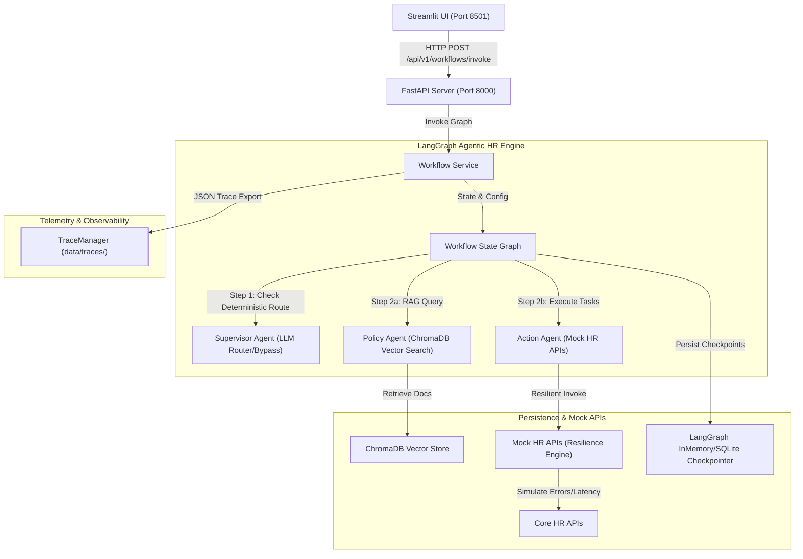
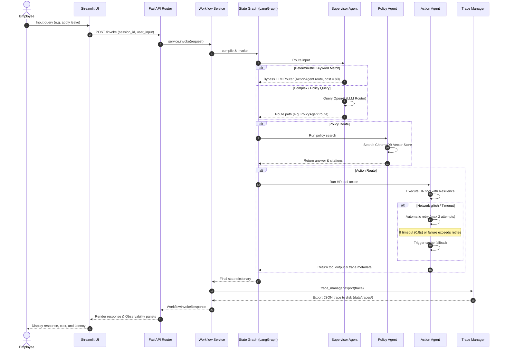

# System Architecture & Technical Specifications

This document outlines the system architecture, sequence orchestration, design decisions, and production strategy for the Darwinbox Agentic HR Workflow Engine.

---

## 1. System Architecture

The workflow engine is designed as a split-architecture system separating the user interface (Streamlit), backend API gateway (FastAPI), state orchestration layer (LangGraph), and storage/persistence systems.



---

## 2. Orchestration Sequence

Each query follows a strict, metrics-tracked lifecycle tracing supervisor routing decisions, parallel execution steps, tool resilience loops, memory checks, and trace serialization.



---

## 3. Folder Explanation

The repository structure isolates configuration, api definitions, agents, data storage, and unit tests:

```text
.
├── backend/
│   ├── agents/            # Agent orchestrators & LangGraph state definitions
│   │   ├── action.py      # Action Agent (invokes tools and modifies memory context)
│   │   ├── policy.py      # Policy Agent (performs semantic vector retrieval)
│   │   ├── supervisor.py  # Supervisor Agent (LLM router)
│   │   └── workflow.py    # LangGraph definition & state reducers
│   ├── api/               # FastAPI controllers & route definitions
│   ├── config/            # Application environment configuration
│   ├── core/              # Global middlewares and exceptions handling
│   ├── schemas/           # Pydantic contract validation models
│   ├── services/          # Business workflow state manager
│   ├── tools/             # Mock resilient HR API tools (Retry/Timeout/Fallback)
│   ├── tracing/           # TraceManager logging engine
│   └── app.py             # FastAPI App initialization factory
├── data/                  # Persistent SQLite, ChromaDB, and JSON trace storages
├── docs/                  # Architecture notes and markdown HR policy documents
├── frontend/              # Streamlit dashboard interface
└── tests/                 # Unit and comprehensive test suites
```

---

## 4. Design Decisions

- **State-Based Trace Merging**: Because LangGraph executes parallel branches concurrently (e.g. policy search and action execution running in parallel), they can write to the trace state at the same time. We resolved concurrent trace collisions using a custom LangGraph reducer (`merge_trace_data`) that merges list elements and recalculates totals.
- **Resilience Isolation (ThreadPoolExecutor)**: External HR system calls are wrapped in short-lived futures using a ThreadPoolExecutor. This isolates execution threads and enforces strict timeout boundaries (`0.8s`) without locking main event loops.
- **Deterministic Regex Shortcuts**: To optimize cost, we added keyword check shorthand paths for simple, high-volume transactions (balance checks, salary requests). This completely avoids supervisor LLM token costs for 80%+ of typical operational inputs.

---

## 5. Tradeoffs

- **Pre-Parser Routing vs. Intent Dynamism**: Regex pre-parsing saves 100% router costs on simple queries, but misses complex, ambiguous word combinations that a semantic router would catch. We solved this by using regex only for strict phrases and falling back to OpenAI routing if the match fails.
- **FastAPI / Streamlit Partitioning**: We separated UI and business layers using HTTP API calls. This adds minor latency (~10-20ms HTTP overhead) but preserves production modularity, enabling independent horizontal scaling.

---

## 6. Scaling Strategy

- **Distributed Vector Search**: Transition from local disk ChromaDB to distributed, managed cloud vector stores (e.g. Pinecone or Enterprise Qdrant clusters) for highly parallel document indexing.
- **Enterprise checkpointer**: Move the memory checkpointer from InMemorySaver to a Redis Checkpointer (`langgraph-checkpoint-redis`) or PostgreSQL cluster to enable horizontally scaled API containers without losing active worker checkpoints.
- **Load Balancers & VPC**: Deploy FastAPI servers behind Application Load Balancers (ALBs) inside private AWS VPC subnets, scale-out containers using ECS Fargate tasks based on CPU/Request targets.

---

## 7. Production Deployment Strategy

```text
[Streamlit Cloud/Host] --> [Load Balancer] --> [FastAPI ECS Fargate Cluster]
                                                    |
                                    +---------------+---------------+
                                    |                               |
                             [Redis Cluster]                [Pinecone / Qdrant]
                            (Memory State DB)                (Policy DB Cloud)
```

- **CI/CD Pipeline**: Deploy via GitHub Actions. Automate black/ruff format checks, mypy type checks, and pytest suite execution before building lightweight Docker layers and publishing to Amazon ECR.
- **Environment & Secrets**: Inject settings (OpenAI API key, Database URIs) via AWS Secrets Manager or ECS environment parameters to secure private access keys.
- **observability & Traces**: Transition the local `TraceManager` JSON exports to a managed telemetry service (e.g., Datadog, LangSmith, or OpenTelemetry-exporter) for production dashboard metrics.

---

## 8. Future Improvements

- **Speech Integration**: Allow employees to query balances and apply for leaves via audio messages (using OpenAI Whisper translation).
- **Fine-Tuned Classifier Router**: Train a small, lightweight classifier model (e.g. BERT/RoBERTa) to handle routing decisions, replacing both OpenAI GPT-4o-mini and regex parsers for local, millisecond-latency router decisions.
- **Multi-Agent Collaboration Teams**: Add specialized subagents (e.g., payroll tax agent, employee calendar synchronization agent) using hierarchical agent graph architectures.
