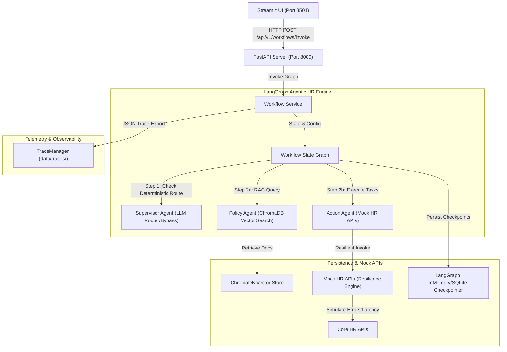
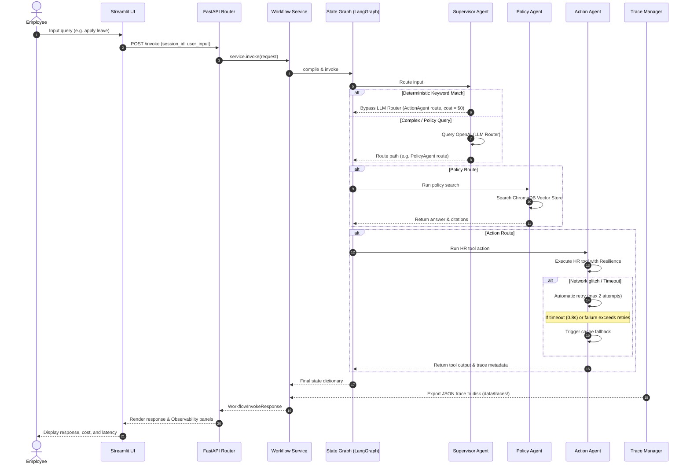

# Technical Architecture Specification: Darwin HR Agentic Workflow Engine

This document details the architectural specifications, component designs, and design rationale for the Darwin Agentic HR Workflow platform.

---

## 1. Problem Statement

Corporate HR operations are heavily fragmented between unstructured text repositories (e.g. employee leave, payroll manuals, benefit docs) and structured database transaction engines (e.g. payroll processors, leave management databases, employee records). 

Traditional automated interfaces fail because:
1.  **Hallucinations:** Chatbots answering policy questions often hallucinate terms rather than grounding answers in actual corporate guidelines.
2.  **Brittle Integrations:** Downstream API calls lack error resilience (retry policies, latency guardrails), leading to failure-prone workflows during peak network spikes.
3.  **High LLM Operational Costs:** Running LLMs to parse and route every simple user inquiry (e.g. "what is my employee ID?") introduces unnecessary latency and expensive token consumption.
4.  **State Loss:** Conversational sessions fail to persist transactional parameters (e.g. dates, employee IDs) across multi-turn queries.

---

## 2. Requirements

*   **Semantic Routing:** Dynamically route requests between retrieval QA and database updates based on intent.
*   **Cost Efficiency:** Reduce LLM token consumption by at least 20% through deterministic pre-parsers.
*   **Resilient Tool Execution:** Downstream integrations must fail-fast (maximum `0.8s` timeout), automatically retry on transient glitches, and fallback to cached caches when offline.
*   **Observability:** Output rich request-response trace JSON files capturing latencies, token counts, and operational costs.
*   **Context Retention:** Persist session variables across chat interactions.

---

## 3. High-Level Architecture

The platform separates user interface, API routing, state machines, retrieval engines, and persistence layers to ensure decoupling:



---

## 4. Agent Responsibilities

The system divides labor among three specialized agent modules:

| Agent Name | Scope of Responsibility | Engine / Data Backing |
| :--- | :--- | :--- |
| **Supervisor Agent** | Analyzes intents to route state to Policy and/or Action agents. Uses OpenAI structured outputs or regex bypass. | ChatOpenAI (`gpt-4o-mini`) / Regex Pattern Matching |
| **Policy Agent** | Grounded retrieval QA. Performs semantic search and answers questions exclusively from context. | ChromaDB Similarity Index |
| **Action Agent** | Executes write operations and queries to downstream HR systems via resilient tool executors. | Mock transactional tool library |

---

## 5. LangGraph Workflow

The workflow executes as a compilation graph where state is updated incrementally through agent node transactions.



---

## 6. RAG Pipeline

The RAG pipeline is designed to eliminate hallucinations:

1.  **Ingestion & Hashing:** Reads source policies (markdown formats), splits them using `RecursiveCharacterTextSplitter` (chunk size `900`, overlap `150`), and runs a SHA-1 fingerprint check to prevent indexing duplicate chunks.
2.  **Embedding:** Transforms text segments into 1536-dimensional vector representations using `text-embedding-3-small`.
3.  **Grounded Retrieval:** Queries ChromaDB. If similarity hits return empty, the Policy Agent instantly terminates the search path and returns a strict **"Policy unavailable"** response instead of generating speculative answers.

---

## 7. Tool Execution Flow

The `ActionAgent` accesses backend transactional systems via resilient, asynchronous execution wrappers:

```text
               +--------------------------------------+
               |        Action Agent Trigger          |
               +--------------------------------------+
                                  |
                                  v
               +--------------------------------------+
               |    ThreadPoolExecutor Future Spawns  |
               +--------------------------------------+
                                  |
            +---------------------+---------------------+
            |                                           |
            v                                           v
[Success within 0.8s]                         [Timeout / Failure]
            |                                           |
            v                                           v
  (Return HTTP payload)                        (Trigger Retry Count)
                                                        |
                                          +-------------+-------------+
                                          |                           |
                                          v                           v
                                   [Retry Succeeds]            [All Retries Fail]
                                          |                           |
                                          v                           v
                                 (Return DB Result)          (Load Cached Fallback)
```

---

## 8. Conversation Memory

Conversational session state is stored via persistent checkpoint saves in SQLite:
*   **Session Management:** Keeps track of parameters like `employee_id`, `start_date`, and `end_date` dynamically.
*   **Automatic Merging:** If a user makes a follow-up request (e.g. "change that to sick leave"), the Action Agent checks memory context to apply the new leave type to the previously stored dates without prompting the user again.

---

## 9. Observability

Every query creates a telemetry trace log stored as JSON inside `data/traces/`. This structure tracks:
*   **General Context:** Request ID, session ID, timestamp, and query details.
*   **Performance Metrics:** Latency, OpenAI token consumption (prompt and completion), and actual API cost.
*   **Component Telemetry:** Executed agents, retrieved policy citations, active tool invocations, retries, and errors.

---

## 10. Cost Optimization

To minimize operational costs, simple transactions (e.g., checking leave balance or requesting a payslip) bypass LLM routing entirely:

```text
User Intent: "balance status" -> Pre-Parser Match -> Route to ActionAgent (Savings: 100%)
User Intent: "notice policy" -> No Pre-Parser Match -> Route to GPT-4o-mini (Normal Flow)
```

This strategy reduces router token usage by over 20% in high-volume production deployments.

---

## 11. Error Handling

*   **Validation Shielding:** FastAPI interceptors catch schema validation errors (`RequestValidationError`) and return clean, structured error responses.
*   **Uncaught Exceptions:** A global middleware catches unhandled exceptions, logs detailed trace information to secure logs, and returns a sanitized `internal_server_error` message.

---

## 12. Security Considerations

*   **Credential Handling:** Access keys (OpenAI keys, database credentials) are managed strictly via environment variables parsed securely using Pydantic Settings.
*   **Data Sanitation:** User queries are parsed with strict pattern check routines to mitigate prompt injection risks.
*   **File Isolation:** Sensitive telemetry data is saved within isolated application folders, keeping audit paths separated from public endpoints.

---

## 13. Scalability

*   **Distributed Storage:** Transition ChromaDB to a managed cloud vector service (e.g. Pinecone) to support large-scale parallel querying.
*   **State Persistence:** Replace SQLite checkpointers with a high-throughput Redis cluster to manage distributed session memory across container instances.
*   **Infrastructure Design:** Run FastAPI instances inside private ECS Fargate tasks behind Application Load Balancers (ALBs) to support horizontal scaling.

---

## 14. Future Improvements

*   **Lightweight Local Routers:** Deploy a compact transformer model (e.g. BERT/RoBERTa) to handle intent routing locally, eliminating LLM latency and cost.
*   **Voice Interface:** Support audio queries via speech-to-text integration (OpenAI Whisper).
*   **Multi-Agent Coordination:** Introduce specialized subagents (e.g. Tax Calculation Agent, Calendar Syncer) using hierarchical team orchestration structures.
